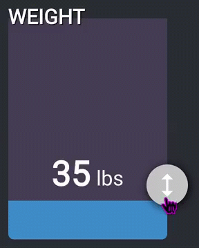
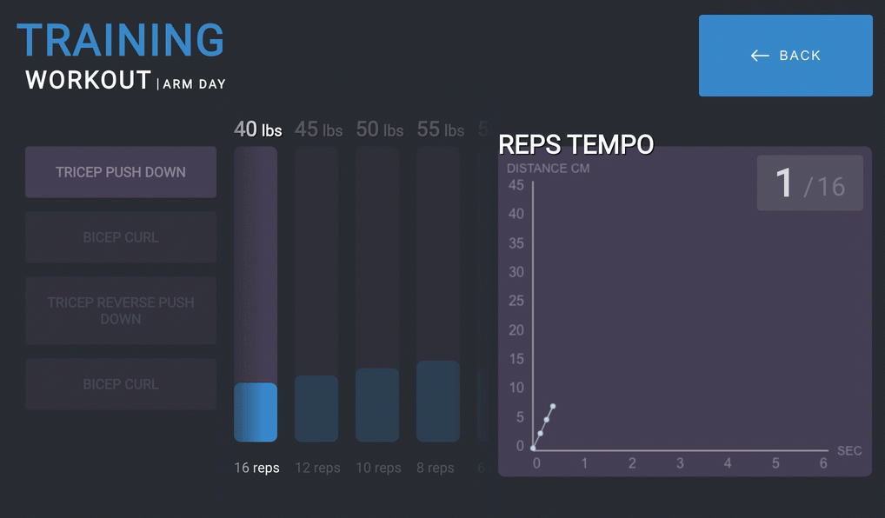
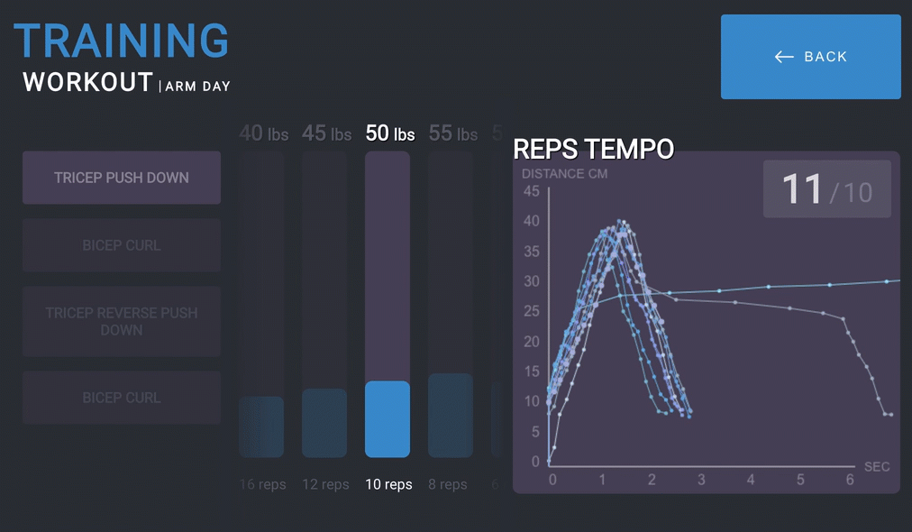
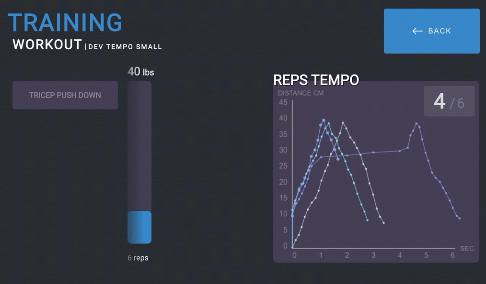
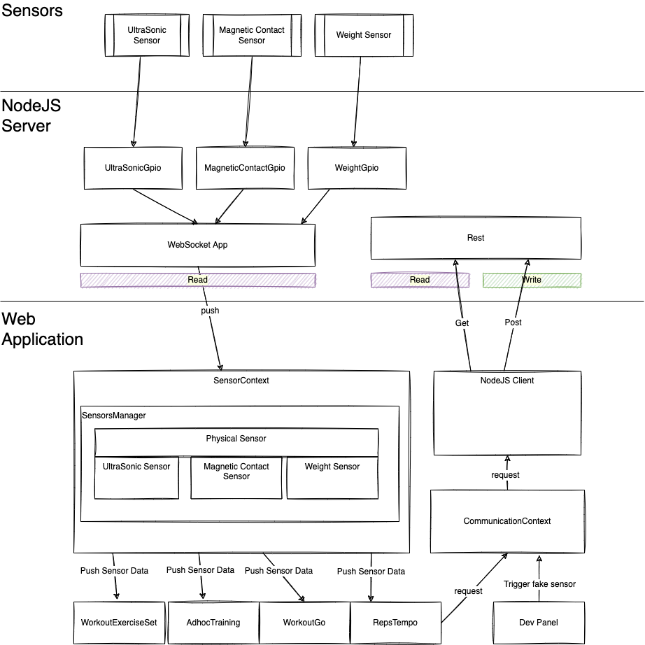
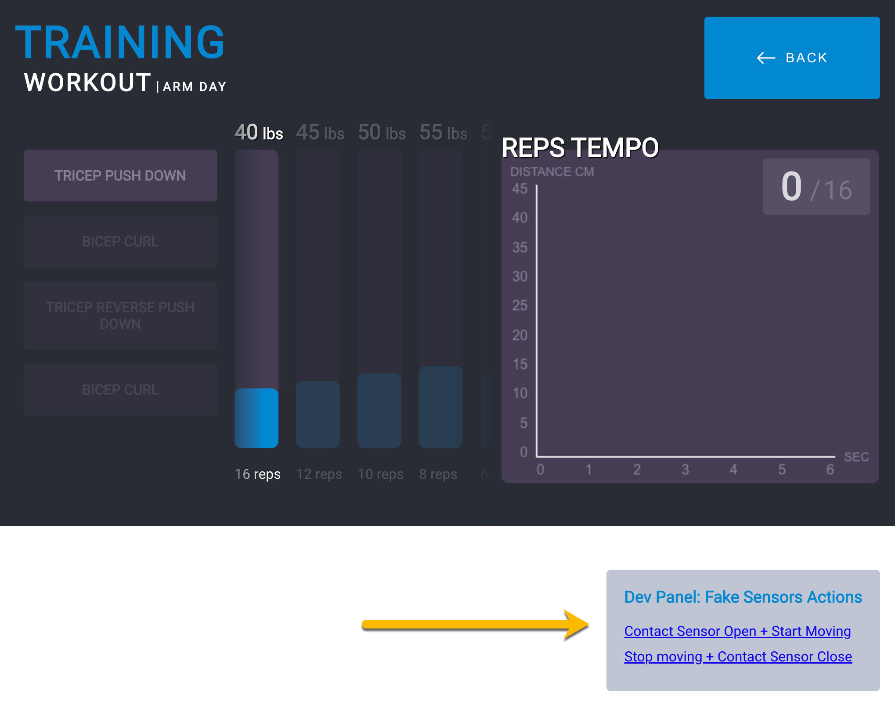

# Gym Water Apps

Source code of the user interface operating the gym machine with water weight. The project consists of a web application hosted in a Raspberry PI where the user is perform weight lifting. The user will use real life pulley to lift containers of water. The containers varies in weight depending of the weight specified per sets and exercises.


# Web Application Screen Grabs
Here are few example of how the project look. 

Custom control to adjust the weight. The slider relies on animated SVG to capture the water theme.



Simulated start of an exercise with two repetitions of a set of expected 16 reps.



If you the use go above the expected amount of repetition for a set. It also shows how the set (middle section) swap to the next one.



Here is the end of a workout animation built with a canvas.



# Details

- The project must run on a Raspberry PI and the output/input is a Touchscreen of 7 inches. The resolution is 1024x600.
- The project consists of many systems. At the current stage, the repository contains only the web application.

# Architecture

## Sensors
The project relies on physical sensors. Many parts of the user interface require to consume the value or the state of one or many sensors. The web application project leverage the concept of _context_ which allows any component to subscribe to sensors.



The architecture forces each component to use a _hook_ to access the context.

```
const sensors = useSensors();
```

Then, to subscribe to the sensor desired. For example, to get the data from the magnetic sensor (open/close).

```
onMount(() => {
  sensors?.sensors.magneticContactSensor.subscribe(magneticContactSensorInput);
  onCleanup(() => {
    sensors?.sensors.magneticContactSensor.unsubscribe(magneticContactSensorInput);
  });
});
```

Then, the callback function is called when the sensor change. The callback is strongly typed. For example, the magnetic is a boolean value while the ultrasonic return a time + distance object.

```
const magneticContactSensorInput = (input: MagneticContactSensorObserverPayload): void => {
  if (input.isOpen) {
   // Do something when the sensor is open
  }
};

// Or

const distanceSensorInput = (input: UltraSonicSensorObserverPayload): void => {
  // Use: input.cm 
  // Or use: input.fullDateTimeInMs
```

The architecture makes the component unaware of specific details. For example, once subscribed to an event, the callbacks are throttled to avoid over-rendering. The throttling occurs at the _observable physical sensor_ in the diagram above. Thus, there is no need to worry about that detail down to the components.

## Dev Panel

The dev panel consumes the sensor in a particular way. Because during development, we do not want to be strongly coupled to the NodeJS server or physical sensors (to which at the time I am writing this line does not even exist), the sensor context can toggle between _real_ and _fake_ state. During the _fake_ state, there is a possibility from the UI to trigger specific sensors that would trigger naturally with physical interaction. For example, the dev panel can initiate a magnetic contact to open/close. The dev panel can trigger the fake sensor to generate a logical sequence of centimeters that simulate a user performing an exercise (lifting the weight.



 The dev panel should not be used in production and will be naturally hidden because it is located under the viewport of the expected 1024x600 resolution.

# Todos

## Visual Features

1. Add pause between set
1. Add tempo expected for rep (eg: 3-2-3)
1. Animation during workout for encouragement (end of a set, end of an exercise, end of workout)
1. Add on the Reps Temp: Expected tempo with a dashed line
1. More animations
1. Merge the thin and fat weight selector

## UI Functional Features

1. Connect to NodeJs for sensors information (might need to throttle)
1. Connect to NodeJs to download workouts (or create on the device ?)
1. Save previous weight for specific exercises, when coming back, we could reload previously used weight